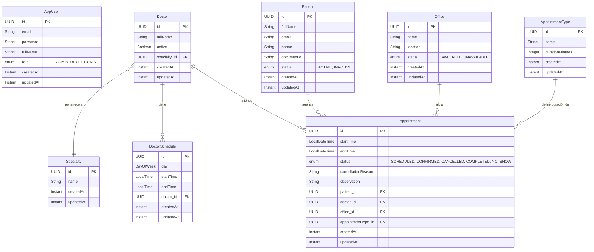

# Diagrama Entidad-Relación - Medsys

```mermaid
erDiagram
    AppUser {
        UUID id PK
        String email
        String password
        String fullName
        enum role "ADMIN, RECEPTIONIST"
        Instant createdAt
        Instant updatedAt
    }

    Specialty {
        UUID id PK
        String name
        Instant createdAt
        Instant updatedAt
    }

    Doctor {
        UUID id PK
        String fullName
        Boolean active
        UUID specialty_id FK
        Instant createdAt
        Instant updatedAt
    }

    DoctorSchedule {
        UUID id PK
        DayOfWeek day
        LocalTime startTime
        LocalTime endTime
        UUID doctor_id FK
        Instant createdAt
        Instant updatedAt
    }

    Patient {
        UUID id PK
        String fullName
        String email
        String phone
        String documentId
        enum status "ACTIVE, INACTIVE"
        Instant createdAt
        Instant updatedAt
    }

    Office {
        UUID id PK
        String name
        String location
        enum status "AVAILABLE, UNAVAILABLE"
        Instant createdAt
        Instant updatedAt
    }

    AppointmentType {
        UUID id PK
        String name
        Integer durationMinutes
        Instant createdAt
        Instant updatedAt
    }

    Appointment {
        UUID id PK
        LocalDateTime startTime
        LocalDateTime endTime
        enum status "SCHEDULED, CONFIRMED, CANCELLED, COMPLETED, NO_SHOW"
        String cancellationReason
        String observation
        UUID patient_id FK
        UUID doctor_id FK
        UUID office_id FK
        UUID appointmentType_id FK
        Instant createdAt
        Instant updatedAt
    }

    Doctor }o--|| Specialty : "pertenece a"
    Doctor ||--o{ DoctorSchedule : "tiene"
    Doctor ||--o{ Appointment : "atiende"
    Patient ||--o{ Appointment : "agenda"
    Office ||--o{ Appointment : "aloja"
    AppointmentType ||--o{ Appointment : "define duración de"
```
